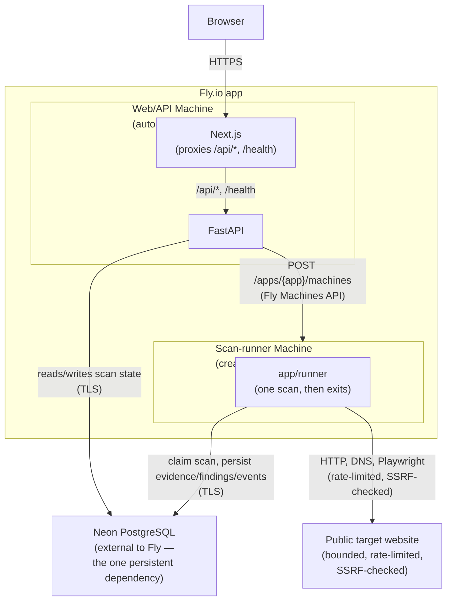

# Architecture

Veritech Scan is a monorepo with two runtime apps — a Next.js frontend and a
FastAPI API — sharing one PostgreSQL database. It deploys as a single Fly.io
app with two Machine roles built from the same production image (see the
root `Dockerfile`):

- **Web/API Machine**: Next.js + FastAPI, always the same Machine(s) `fly
  deploy` manages. Autostops when idle, autostarts on the next request
  (`fly.toml`'s `auto_stop_machines`/`auto_start_machines`/
  `min_machines_running = 0`) — zero always-on compute for this role.
- **Scan-runner Machine**: created on demand, one per scan, via the Fly
  Machines API. Runs exactly one scan and exits; the Machine is then
  destroyed (`config.auto_destroy = true`). There is no persistent worker,
  no queue, and no Redis anywhere in this architecture — scan status lives
  entirely in Postgres and the API polls the database, not an in-memory or
  queue-backed state.

## System diagram

## Why an on-demand Machine instead of a persistent worker

A scan does bounded but genuinely slow, multi-step network I/O: an HTTP
fetch with manual redirect revalidation, robots.txt/sitemap retrieval, a
same-origin crawl of up to 50 pages at one request per 1.5 seconds, six DNS
lookups, a headless Chromium render, and (optionally) a PageSpeed Insights
call — all bounded by a 10-minute total scan timeout. That easily exceeds
any reasonable HTTP request/response cycle, so:

- **The API must return immediately** after validating the target and
  creating the `scan_requests` row, or the browser tab would hang for
  minutes.
- **A dedicated Machine per scan** decouples "a scan was requested" from "a
  scan is running" without needing a broker (Redis/Dramatiq) to hand work
  between an always-on API and an always-on worker. The API asks the Fly
  Machines API to create one Machine with the scan ID in its environment;
  that Machine claims the scan, runs it, and exits.
- **No idle worker cost.** A traditional queue+worker setup pays for a
  worker process sitting idle between scans. Here, compute exists only for
  the duration of an actual scan (plus the API's own request-driven
  autostart/autostop) — see `docs/fly-deployment.md` for cost notes.
- **One scan per runner, by construction.** Chromium is memory-hungry;
  giving each scan its own Machine (sized in
  `app/services/scan_orchestrator.py::request_scan_runner`) avoids the
  concurrency/memory trade-offs a shared worker process would need.
- **The frontend polls**, rather than holding a connection open, using
  TanStack Query's `refetchInterval` against `GET /scans/{id}` and
  `GET /scans/{id}/report` while status is `queued`, `starting`, or
  `running`.

## Scan initiation flow

1. Browser submits an authorized scan through the existing UI.
2. FastAPI validates the URL, authorization acknowledgment, ownership, and
   scan limits (`app/api/v1/scans.py`, `app/services/scan_orchestrator.py`).
3. FastAPI writes a `scan_requests` row with status `queued` plus its
   `scan_jobs`/`scan_targets` skeleton (`create_scan`).
4. FastAPI calls `request_scan_runner`, which uses the Fly Machines API to
   create a scan-runner Machine, passing the scan ID via the `SCAN_ID`
   environment variable. On success the scan moves to `starting` and
   `runner_machine_id` is recorded; on failure the scan is marked `failed`
   with a `runner_creation_failed` event and the API returns a clean error
   — a scan is never left `queued` while looking like it's running. (Local
   development without a `FLY_API_TOKEN` spawns the same runner code as a
   plain background subprocess instead of calling Fly — see that
   function's docstring.)
5. The scan-runner (`python -m app.runner`, `app/runner/run.py`) reads
   `SCAN_ID`, atomically claims the scan (`UPDATE ... WHERE status IN
   ('queued','starting') RETURNING id` — this is the duplicate-runner
   guard), and sets status `running`.
6. The runner executes each collection area in a fixed sequence — HTTP
   checks, robots/sitemap, crawl, DNS/email posture, browser render,
   technology detection, performance, then the rules engine — via
   `_run_job`, which:
   1. Marks the corresponding `scan_jobs` row `running` and records a
      `{task}_started` event.
   2. Calls the collector function with up to `MAX_ATTEMPTS = 2` tries.
   3. On success, marks the job `succeeded` and records a `{task}_succeeded`
      event.
   4. On permanent failure, marks the job `failed`, records the error, and
      **the runner continues to the next collection area** — one collector
      failing never aborts the whole scan (`determine_scan_status`,
      covered by `tests/backend/test_scan_status.py`).

   A wall-clock deadline (`SCAN_MAX_TOTAL_MINUTES`, default 10) is checked
   before starting each remaining area; once it passes, remaining areas are
   skipped (their `scan_jobs` rows stay `pending`) and the rules engine
   still runs against whatever evidence exists. `heartbeat_at` is updated
   between stages so a crashed runner is detectable without needing a final
   event.
7. The runner sets the final scan status (`completed` /
   `completed_with_warnings` / `failed`), builds and stores the HTML
   report, and records `scan_completed`/`report_finalized`/`runner_exited`
   events.
8. The Machine's process exits; Fly destroys it (`config.auto_destroy`).
   Any unhandled runner-level exception is caught, marks the scan `failed`
   with a `runner_failed` event, and the process exits non-zero.
9. The browser keeps polling the normal API for status and report data
   throughout — it never talks to the runner Machine directly.

## Evidence flow

Collectors never write "findings" directly. Each one persists into its own
typed observation table (`http_observations`, `dns_observations`,
`pages`, `technology_observations`, `performance_observations`,
`third_party_dependencies`) **and** one or more normalized `evidence_items`
rows — the product's actual core data model (see
`apps/api/app/models/evidence.py`). An evidence item always has a
`category`, `source_type`, `confidence`, a `normalized_payload_json`, and a
`human_readable_summary`. Raw HTTP responses are never stored as the primary
record; screenshots and generated report HTML go to the artifact storage
directory (`ARTIFACT_STORAGE_LOCAL_PATH`) through `ArtifactStorage`
(`apps/api/app/services/artifact_storage.py`), referenced by path, not
embedded in Postgres. On Fly, this path is local to the (ephemeral)
scan-runner Machine's own filesystem — the report itself is always rebuilt
live from Postgres when requested (`GET /scans/{id}/report` and
`/export/html`), so nothing the browser needs depends on that ephemeral
file surviving.

## Rules engine flow

After collection, `run_rules_engine(db, scan)` (`apps/api/app/rules/engine.py`)
builds a `RuleContext` from the observation tables + evidence items already
persisted, runs every registered deterministic rule function against it, and
persists a `Finding` + `FindingEvidence` row per match — always citing the
real evidence item ID(s) that justified it. See `docs/rules-engine.md`.

## Report output

`GET /scans/{id}/report` (`apps/api/app/services/report_builder.py`) builds
a `ReportOut` by re-querying findings + observations for the scan. The same
`ReportOut` is rendered to HTML by
`apps/api/app/templates/report.html.jinja` for `GET /scans/{id}/export/html`
— a self-contained, print-friendly page (a "Print / Save as PDF" button is
the only script on the page).

## Why the database is the only persistent dependency

PostgreSQL is the sole stateful piece of this architecture — everything
else (web/API Machines, scan-runner Machines) is disposable/replaceable
compute. Scan status, events, evidence, findings, and reports are all
Postgres rows; the API layer never holds scan state in memory or in a
queue, so restarting or replacing any Machine never loses scan state that's
already been persisted. See `docs/fly-deployment.md` for how the database
itself is provisioned and `docs/fly-operations.md` for inspecting/cleaning
up Machines.
